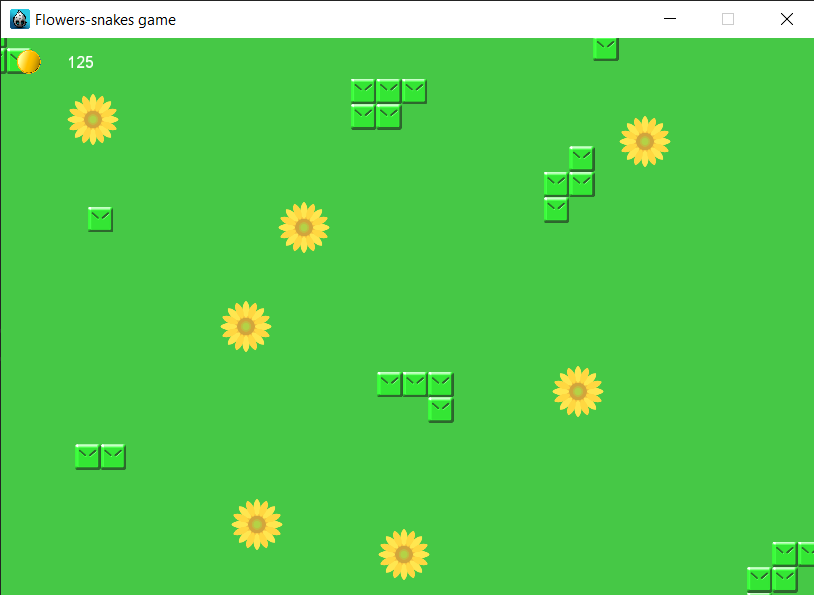

# Flower-farm
2d farm game developed with C++ and Cocos2d-x framework.

# Getting started
IDE: Visual Studio 2012 and above.
Project supports Windowns only.

This project is no longer maintained.
Cocos2d-x framework is in cocos2d folder.
So you can just clone repo and open com.kryvytskyi.flowersSnakesGame.sln solution file at proj.win32.

`git clone https://github.com/kryvytskyidenys/Flower-farm`

# Screenshots

